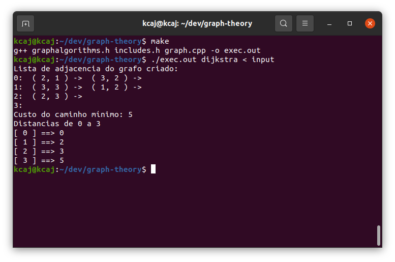
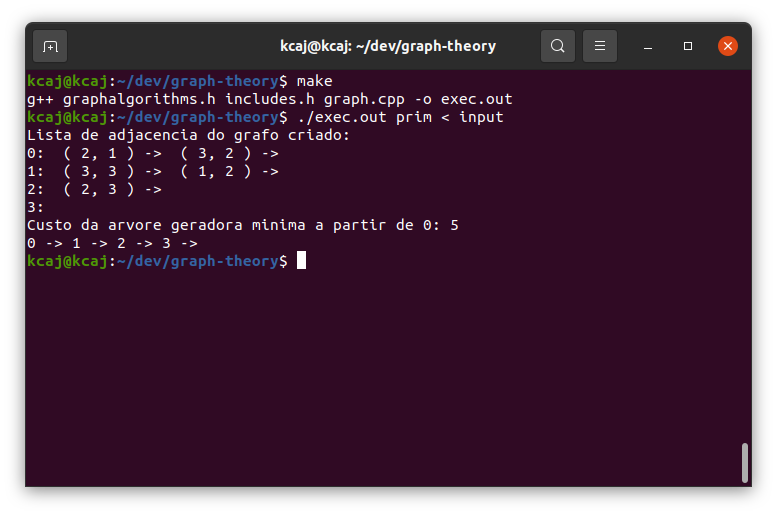
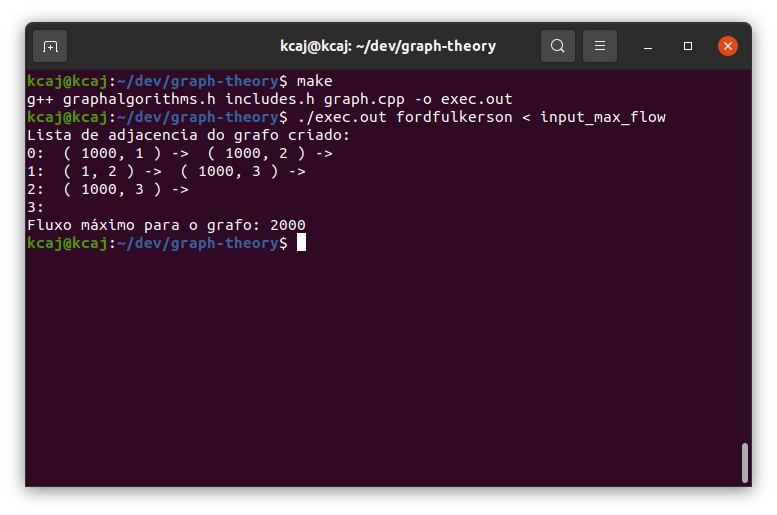
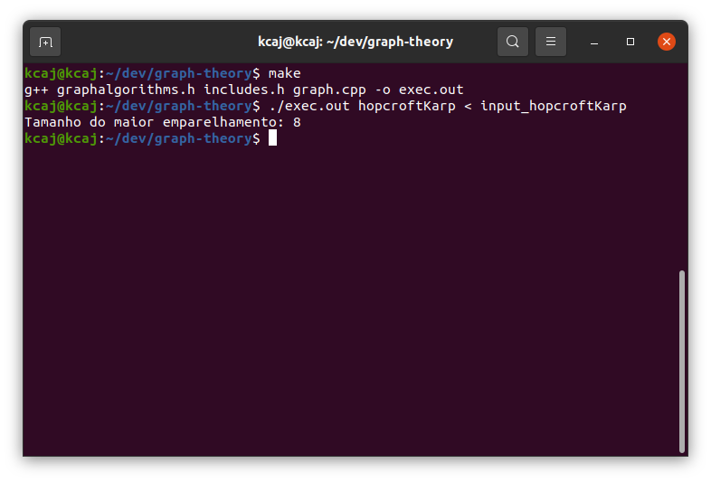
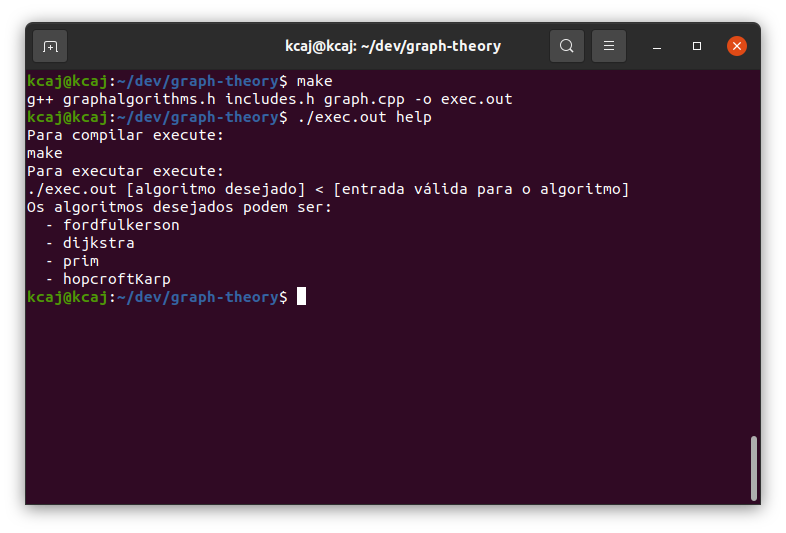
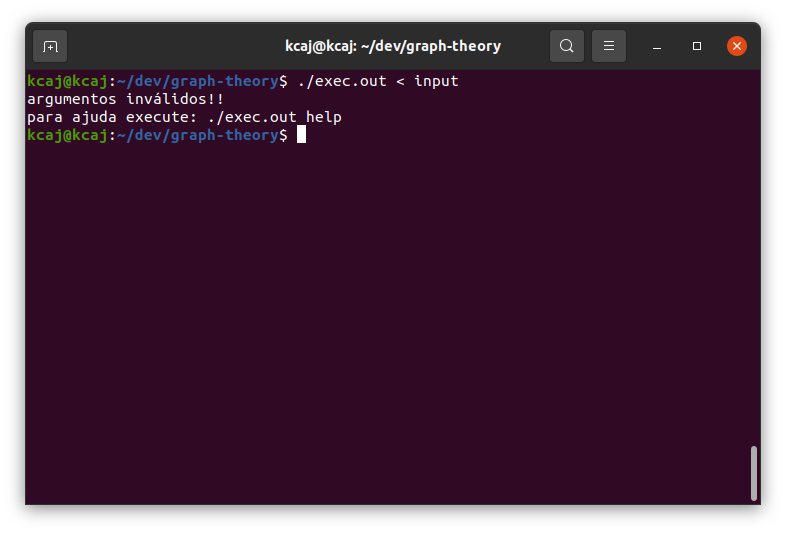

# AB2 - Teoria Dos Grafos

## Alunos: Jackson Barbosa da Silva e Samuel Lucas Vieira Lins Barbosa
## Curso: Ciência da Computação


## Instruções:

### Compilar
Para compilar execute o comando *make*

### Executar
Para executar, você deve seguir o seguinte padrão:

```sh
./exec.out <nome_algoritmo> < <nome_entrada_algoritmo>
```

### Executar os exemplos presentes no projeto

#### Dijkstra:

```sh
./exec.out dijkstra < input
```
Ao rodar este comando, você terá como saída a lista de adjacencia criada, a distancia mínima do vertice 0 ao vertice *v - 1* (o vertice de maior índice) e o estado final do array de distâncias



#### Prim:
```sh
./exec.out prim < input
```

Ao rodar este comando, você terá como saída a lista de adjacencia criada e o custo da arvore geradora mínima e o caminho que forma árvore em pré ordem.



#### Ford Fulkerson:
```sh
./exec.out fordfulkerson < input_max_flow
```

Ao rodar este comando, você terá como saída a lista de adjacencia criada e o fluxo máximo que pode-se passar pelo grafo do input utilizado.



#### Hopcroft-Karp:
```sh
./exec.out hopcroftKarp < input_hopcroftKarp
```

Ao rodar este comando, você terá como saída o tamanho do  emparelhamento máximo do grafo do grafo do input utilizado.



#### Help
```sh
./exec.out help
```
Ao rodar este comando, será apresentada uma tela com um pequeno resumo de como usar o programa.



### Error

Para o caso de não executar o programa como descrito acima, você chegará a seguinte janela:

